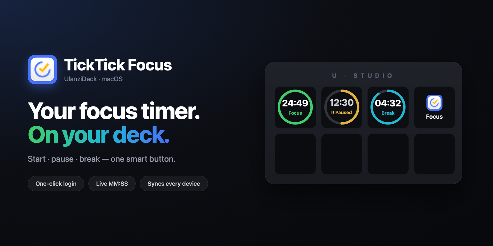
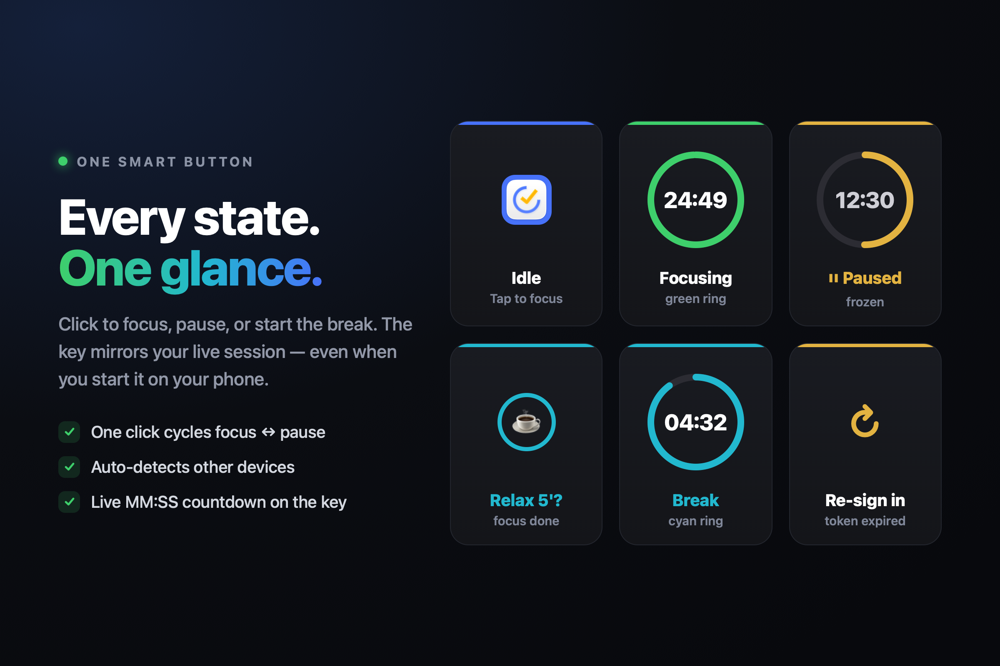
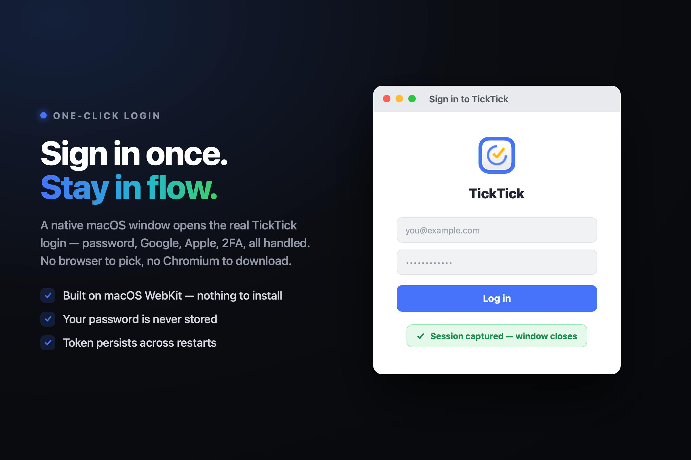

# TickTick Focus - Ulanzi Deck Plugin

**Your TickTick focus timer — live on a physical button.**

Start, pause, and break your pomodoro from one smart key. No app switching, no dashboards.



[](LICENSE)
[]()
[]()
[]()
[]()

> **Disclaimer:** this is an independent, open-source project built by a fan. It is **not affiliated with, endorsed by, or supported by TickTick**. "TickTick" is a trademark of its respective owner.

---

## Why this exists

You start a focus session on your phone, switch to your Mac, and lose track of how much time is left. Or you want to start a pomodoro without breaking flow to find the app.

TickTick Focus puts your live focus timer on a physical button in front of you — one tap to start, pause, or take the break, always in sync with every device.

---

## Install

```bash
/bin/bash -c "$(curl -fsSL https://raw.githubusercontent.com/narlei/ulanzideck-ticktick/main/install.sh)"
```

> **Requirements:** macOS · [Ulanzi Studio](https://www.ulanzi.com/pages/download)

One command. It downloads the latest release, installs it, unblocks the native login helper, and restarts Ulanzi Studio. UlanziDeck ships its own Node, so there's nothing else to install.

---

## One button, every state

Drag the **Focus** button to your deck. A single click cycles focus ↔ pause; when a session ends it offers the break. The key mirrors your live session even when you started it on another device.



| State | The button shows | A click does |
|---|---|---|
| **Idle** | TickTick check + "Focus" | start a 25-min focus |
| **Focusing** | green ring + live `MM:SS` | pause |
| **Paused** | amber `MM:SS` + ⏸ | resume |
| **Relax?** | "Relax 5'?" (cyan) | start the 5-min break |
| **Break** | cyan ring + live `MM:SS` | pause / resume |
| **↻ Re-sign in** | amber ↻ | reopen the login window |

The button **never ends or abandons** a session — that stays a deliberate action in TickTick. Durations follow your TickTick pomodoro preferences, or you can override them per button.

---

## Sign in once, stay in flow

Click **Sign in to TickTick** in the button settings. A small native window — built on the macOS WebKit engine already on your Mac, no Chromium, no download — opens the real TickTick login. Log in however you normally do (password, Google, Apple, captcha, 2FA); it's a real browser engine.



As soon as the session is captured, the window closes and the token is saved. **Nothing is stored except the session token** — never your password. The token persists across restarts (in `~/Library/Application Support/TickTickFocus/`), and if it ever expires the button shows **↻** — just sign in again.

> **Advanced:** you can also paste the `t` cookie value manually (ticktick.com → dev tools → Application/Storage → Cookies → `t`).

### Why a login window instead of email/password fields?

TickTick's web login requires a browser-generated `X-Csrftoken` that a headless request can't forge — a raw email/password POST gets rejected even with the correct password. Driving the real WebKit engine sidesteps that entirely: the page generates its own CSRF token and handles captcha/2FA, and the plugin just reads the resulting `t` cookie (WKWebView can read HttpOnly cookies, which page JavaScript can't).

---

## Privacy & security

Your data stays private, by design:

- **No third-party server.** The plugin talks directly to `ticktick.com` / `ms.ticktick.com` — never to any server run by this project or anyone else.
- **No analytics, no telemetry.** Nothing about your tasks, focus sessions, or usage is collected or transmitted anywhere.
- **Your password is never seen or stored.** Login happens in a real WebKit window owned by TickTick; the plugin only ever reads the resulting session cookie.
- **Only a session token is stored, and only locally**, in `~/Library/Application Support/TickTickFocus/` on your own Mac.
- **Open source.** Every line is in this repo — audit it yourself.

---

## How it stays in sync

State is server-authoritative. The plugin polls TickTick's live focus endpoint every ~30 s (paused when the key isn't visible) and ticks the `MM:SS` countdown locally each second in between. A click sends the operation, updates the button optimistically, and reconciles with the server — so a focus started on your phone shows up here within seconds.

> ⚠️ The TickTick focus endpoints are **private / unofficial** and may change without notice. Everything host-specific is isolated in one file; failures degrade to an error/re-sign-in screen instead of crashing.

---

## Development

```bash
git clone https://github.com/narlei/ulanzideck-ticktick
cd ulanzideck-ticktick
make install   # compile the native helper + sync to UlanziDeck + restart
```

| Command | What it does |
|---|---|
| `make package` | Build distributable ZIP → `dist/` |
| `make login-bin` | Compile the native login helper (universal binary) |
| `make sync` | Sync files without restarting |
| `make restart` | Restart Ulanzi Studio only |
| `make bump_patch` | Bump version (patch / minor / major) |

Set `TTF_DEBUG=1` when running `node plugin/app.js` by hand to get verbose logs.

**Layout**

```
com.narlei.ticktickfocus.ulanziPlugin/   # the plugin bundle
├── plugin/            # app.js, ticktick-client.js, focus-state.js, renderer.js
├── property-inspector/
├── resources/         # icon.png, action.png, ticktick-login (native helper)
└── en.json / pt_BR.json
native/ticktick-login.swift               # WKWebView login helper source
install.sh                                # curl|bash installer
```

---

MIT © [Narlei Moreira](https://github.com/narlei)
